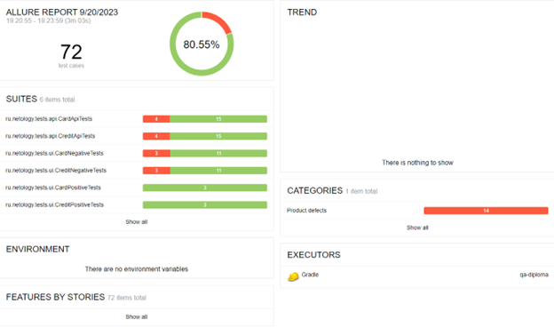
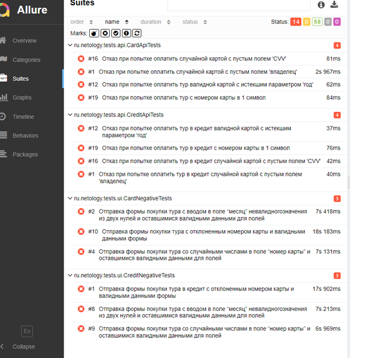

# Отчет о проведенном тестировании

## 1. Краткое описание работ

В ходе выполнения дипломной работы было произведено функциональное
и автоматизированное тестирование веб-сервиса "Путешествие дня". 

"Путешествие дня" - комлекстный сервис, взаимодействующий с шлюзом API банка (заглушкой)
и СУБД.

## 2. Количество тест-кейсов

- Всего тест-кейсов: 72
- Процент успешных тест-кейсов: 80,55%

- UI автоматизированных тестов: 38
- API автоматизированных тестов: 34

Перечень "упавших" тест-кейсов: 

## 3. Общие рекомендации

1. Устранить [дефекты](https://github.com/IrinaChapurina/qa-diploma/issues) в приложении
2. Необходимо доработать документацию по допустимым принимаемым 
значениями в форме банка
3. Составить API документацию
4. Расширить документацию по запуску инфраструктуры приложения